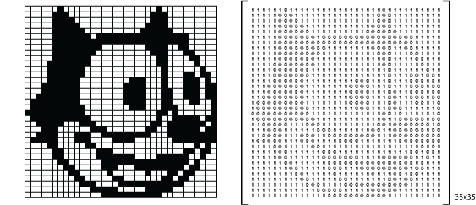
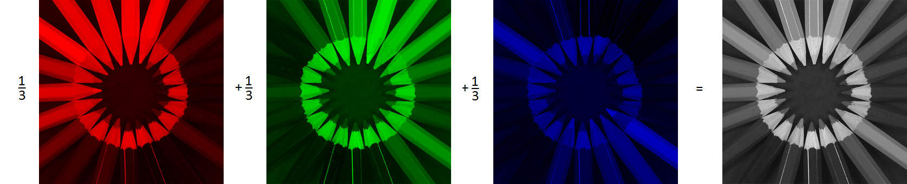
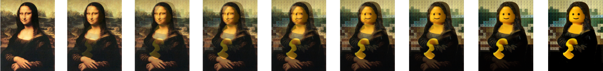
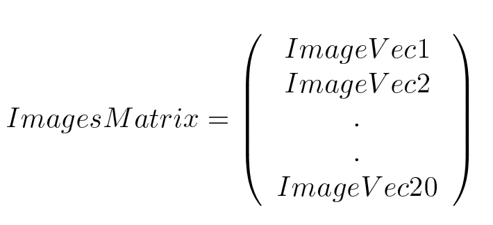
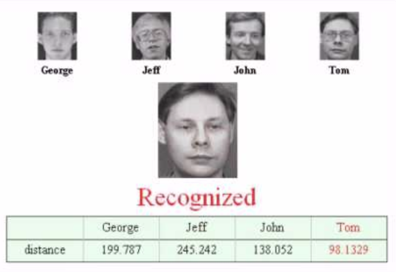
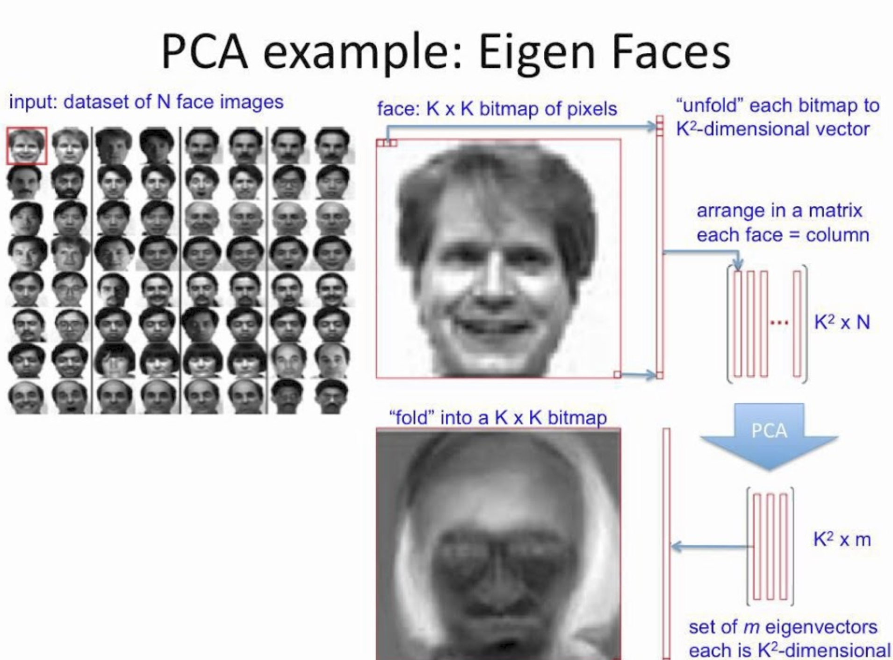
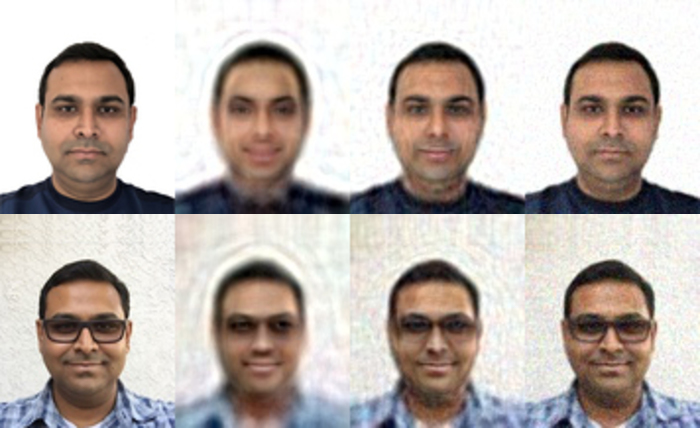

# PCA and Digital Image Processing 

## Introduction

So far we have looked at applying PCA on simple datasets in order to understand the mechanism of this algorithm. PCA really shines when applied to complex high dimensional data. In this lesson, we shall look at Image Processing and how PCA can help us analyze, recognize and compress spatial image data by reducing the number of dimensions of an image and thus simplifying the analyses. 
## Objectives

You will be able to:
- Understand and describe how digitized images are represented in a computational environment
- Develop an intuition on how images are processed in a number of ways using matrix algebra
- Evaluate the role of PCA towards facial recognition with Eigenfaces
- Explain how Image compression can be achieved through PCA for performance oriented analyses. 

## Digital Image Representation 
All the images that you see on your computer screens/mobile phones, the photos you take with your mobile phone are examples of digital images. It is possible to represent such digitized images in a computational environment using matrices. 

### Black and white images

The small vblack and white image of Felix the Cat can be represented by a 35x35 matrix whose elements are the numbers 0 and 1 . These numbers represent the color of each pixel in the image, the number 0 indicates black, and the number 1 indicates white. Digital images using only two colors are called binary images or boolean images.

The image would be digitized as a matrix as shown below:

The 35x35 matrix that you see above, on the right hand side , is actually matrix representation of real image. The image can be stored and processed in the matrix form, and converted back to a display image by filling the pixels o the screen, according to values given in the matrix. 

### Greyscale images
Grayscale images can also be represented by matrices. In this case, each element of the matrix determines the intensity of the corresponding pixel. For convenience, most of the current digital files use integer numbers between 0 (to indicate black, the color of minimal intensity) and 255 (to indicate white, maximum intensity), giving a total of 2^8 - 256 different levels of gray.

Above shows a low resolution (low pixel count), greyscale image of Abraham Lincoln. Here we can see how different levels of grey are being represented as numerical elements of a matrix, with a range between 0 - 255 as mentioned above. 

### Color images
Color images can be represented by three matrices. Each matrix specifies the amount of red, green and blue (RGB) that makes up the image. This color system is known as RGB. The elements of these matrices are integer numbers between 0 and 255, and they determine the intensity of the pixel with respect to the color of the matrix. Thus, in the RGB system, it is possible to represent 256^3 = 2^{24} = 16777216 (16 million) different colors.

## Digital Image Processing and Matrix Algebra

Once a digital image is represented by matrices as shown above, we can perform matrix operations on the images to process and analyze it in different ways. For example, Consider Felix the Cat's binary image shown above. 

In the first image above, we see a matrix, $A = (a_{i,j})$ , where i and j represent the location of a pixel in the 2D image. 

The image B corresponds to the transposed matrix of A, that is, $B = (b_{i, j}) = (a_{j, i}) = A^{T}$. 

The image H corresponds to the matrix $(a_{j, 35 - i + 1})$. 

__Bonus__: Try to discover the matrix relationships between the image A and the other images!

For colored images, if we take the arithmetic mean of the component matrices R, G and B from a color image A, we will get a Grey scale version of the image (non-integer values are rounded to the nearest integer) as shown below:

Similarly, image effects/filters and animations can be created by matrix algebra , below is another example how Mona Lisa transforms into a Lego face. 

## A Generalized Representation

When using these sort of matrix techniques in computer vision, we must consider representation of images. A square, $N$ by $N$ image can be expressed as an $N^2$ dimensional image.
$$X = (x_1, x_2 , .., x_{n^2})$$

Here the rows of pixels in the image are placed one after the other to form a one dimensional image. E.g. The first $N$ elements $(x_1, .., x_N)$ will be the first row of the image, the next $N$ elements are the next row, and so on. The values in the vector are the intensity values of the image, possibly a single Grey scale value.

## Image Recognition with PCA 

Suppose we have 20 images (ImageVec1 to ImageVec20)  having a size N by N i.e. each image is N pixels high by N pixels wide. For each image we can create an image vector as described in the section above. We can then put all the images together in one big image-matrix.

This gives us a starting point for our PCA analysis, as we did with simpler datasets earlier. Here each image becomes an observation, whereas the pixel values represent dimensions of the data (Remember all images have same dimensions). Once we have performed PCA, we have our original data in terms of the eigenvectors we found from the covariance matrix.

### Why is this useful? 

For an application like object/facial recognition, we can start with a dataset containing objects/people's faces. Given a new , previously unseen face image, We can identify the object (or whose image is it when it is a face), based on images available in the training dataset. For such an application, we measure the difference between the new image and the original images. This difference is measured on the new axes described by PCA instead of original dataset. Below is a quick example of how this may look in practice.

## EigenFaces
PCA has a very good application which is in the computer vision domain, called __EigenFace__. Eigenface is a name for eigenvectors which are the components of the face itself. It has been used for face recognition where the most variations considered as important. 

It turns out that these axes works much better for facial recognition, because the PCA analysis gives us the original images in terms of the differences and similarities between it, and the new face i.e. identifying the statistical patterns in the data.

Since all the vectors are $n^2$ dimensional, we can get $n^2$ eigenvectors. In practice, we are able to leave out some of the less significant eigenvectors, and the recognition still performs well with a comparatively low cost.
This behavior is shown in the example below.

## PCA for image compression

Dimensionality reduction offered by PCA can also be used for image compression. This idea is known as also know as "Hotelling Transform". 

Just like earlier, if we have 20 images, each with $N^2$ pixels, we can create  $N^2$ vectors, each with 20 dimensions. Each vector consists of all the intensity values from the same pixel from each picture. This is different from the previous example because before we had a vector for image, and each item in that vector was a different pixel, whereas now
we have a vector for each pixel, and each item in the vector is from a different image.

Now we perform the PCA on this set of data. We will get 20 eigenvectors because each vector is 20-dimensional. To compress the data, we can then choose to transform the data only using, say 15 of the eigenvectors instead of 20. This gives us a final data set with only 15 dimensions, which will save a lot of storage space. However, when the original data is reproduced, the images have lost some of the information. This compression technique is said to be __lossy__ because the decompressed image is not exactly the same as the original, generally worse. An example of a such a lossy compression is shown below.

On the left we see the actual images which are then converted to eigenvectors. On the extreme right we see a reconstructed image, which due to the lossy nature of this approach, takes away some details. All the intermediate images show images created with lesser number of eigenvectors. We can see that with just the right amount of compression, the key features of the faces are preserved. Such techniques could be helpful where performance of a algorithm in terms of speed and agility is desired above all. 

In the next few lessons, we shall apply PCA for image recognition and try to get some hands on experience with Eigenfaces. You are advised to visit the additional resources to get a good idea about basic of image representation, analysis and processing with PCA. 

## Additional Resources
[Digital Image Representation Fundamentals](http://me.umn.edu/courses/me5286/vision/Notes/2015/ME5286-Lecture3.pdf)

[Face Recognition for Beginners](https://towardsdatascience.com/face-recognition-for-beginners-a7a9bd5eb5c2)

[PCA , Eigenfaces and all that](http://bugra.github.io/work/notes/2013-07-27/PCA-EigenFace-And-All-That/)

[Image Compression via PCA](https://fredhohman.com/assets/image_compression.pdf)

## Summary 

In this lesson, we looked at how digital images are presented in an analytics context. We looked at the representation examples for b/w, Greyscale and color images. We also looked at how images, represented as matrices can be manipulated and transformed using matrix algebra. The lesson highlighted the role of PCA in two important areas of Image Processing , i.e. facial recognition and image compression. Next, we shall dive a bit deeper and see how these processes work in python. 
